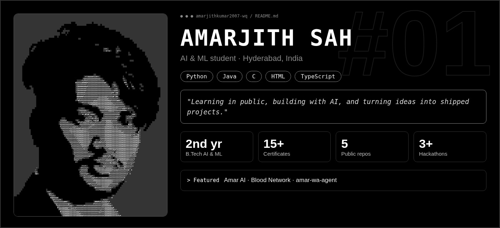

<b>AI &amp; ML student · Hyderabad, India</b>

<i>"Learning in public, building with AI, and turning ideas into shipped projects."</i>

  
  
  
  
  

## 🎓 About
- B.Tech in AI & ML at AVN Institute of Engineering and Technology (JNTUH), batch 2025-2029
- Learning OOP and DSA daily, and exploring RAG and LLM apps
- Looking for an AI/ML internship

## 🚀 Projects
| Project | What it is |
|---|---|
| [**Amar AI**](https://amar-ai-chatbot.vercel.app/) | My AI chatbot: React Native / Expo UI, serverless API, image generation |
| [**Blood Network**](https://blood-network-amar.onrender.com) | Emergency blood donor matching, built for a Cloudinary hackathon |
| [**amar-wa-agent**](https://github.com/amarjithkumar2007-wq/amar-wa-agent) | Personal WhatsApp AI assistant (Flask + Gemini) |
| [**Portfolio**](https://amarjithkumar2007-wq.github.io/Resume-/) | My About Me page |

## 🏅 Highlights
- Tata GenAI Powered Data Analytics, Forage job simulation (Sep 2026)
- Hackathons: Cloudinary / HackIndia, iQOO Hackathon finalist registration, Tata YSIC
- 15+ online certificates, listed on LinkedIn

## 📫 Connect

